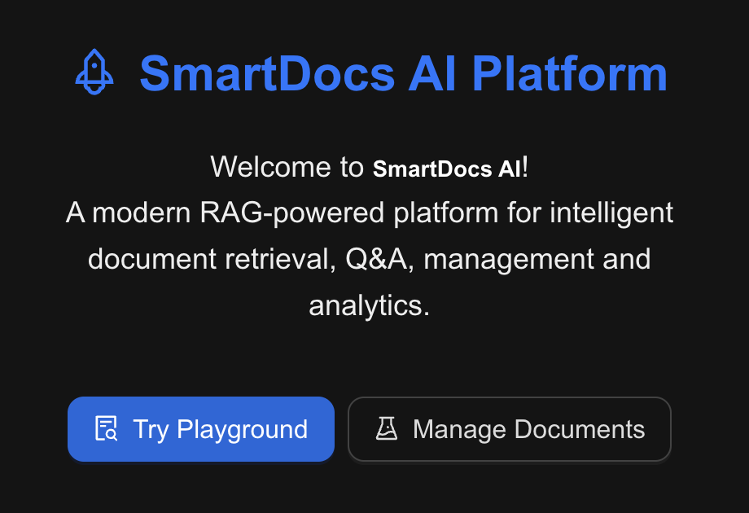
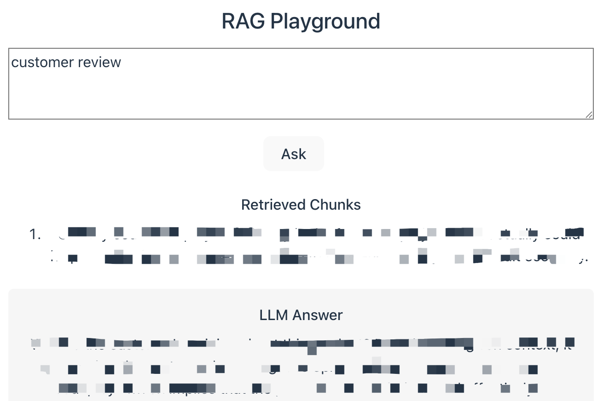
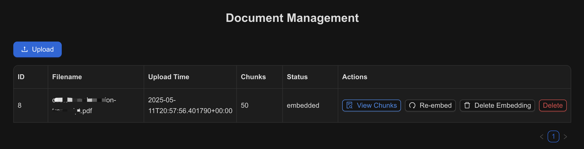
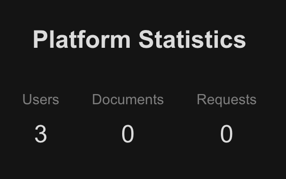
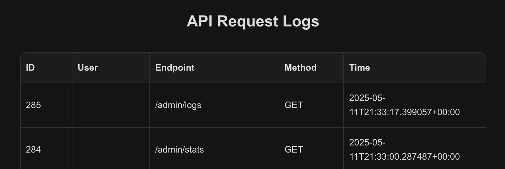
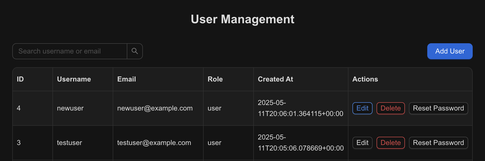

# SmartDocs AI Platform

A Retrieval-Augmented Generation (RAG) document Q&A platform with FastAPI backend, React + Ant Design frontend, HuggingFace Transformers, FAISS, PostgreSQL, JWT authentication, RBAC, logging, and Docker/AWS deployment support.

---

## Screenshots

### Welcome Page


---

### RAG Playground


---

### Document Management


---

### Admin Panel – Platform Stats & API Logs



---

### Admin Panel – User Management


---

## Features

- Document Embedding & RAG Q&A (HuggingFace Transformers, FAISS)
- PDF Upload & Text Extraction
- Q&A with context retrieval
- User Authentication (JWT)
- Role-Based Access Control (RBAC: user/admin)
- API Request Logging & Admin Dashboard
- Statistics: User/Request/Active Users
- PostgreSQL Database (SQLAlchemy ORM)
- React + Ant Design Frontend
- Docker & Docker Compose Support
- AWS ECS Fargate + RDS Production Deployment
- CI/CD with GitHub Actions

---

## Project Structure

```
SmartDocs-AI-Platform/
├── app/                # FastAPI backend
│   ├── api/            # API routers (embed, ask, auth, admin)
│   ├── core/           # Config, security, dependencies
│   ├── db/             # Database models & session
│   ├── models/         # SQLAlchemy models
│   ├── services/       # Embedding, splitter, faiss, log, user
│   └── main.py         # FastAPI entrypoint
├── smartdocs-admin/    # React + Ant Design frontend (Vite + TS)
│   ├── src/
│   │   ├── pages/      # Home, Stats, Logs, Login, etc.
│   │   └── ...
│   └── ...
├── docker-compose.yml  # Local dev: backend + db
├── Dockerfile          # Backend Docker build
├── requirements.txt    # Python backend dependencies
├── README.md           # Project documentation
└── .github/workflows/  # GitHub Actions CI/CD
```

---

## Tech Stack

- Backend: FastAPI, SQLAlchemy, HuggingFace Transformers, FAISS, PyPDF, JWT, RBAC
- Frontend: React, Ant Design, Vite, TypeScript
- Database: PostgreSQL (local & AWS RDS)
- Deployment: Docker, Docker Compose, AWS ECS Fargate, AWS RDS, Nginx
- CI/CD: GitHub Actions (test, build, push, deploy)

---

## Local Development

1. Clone the repo
   ```bash
   git clone https://github.com/SakaNight/SmartDocs-AI-Platform.git
   cd SmartDocs-AI-Platform
   ```
2. Backend
   ```bash
   pip install -r requirements.txt
   uvicorn app.main:app --reload
   ```
3. Frontend
   ```bash
   cd smartdocs-admin
   npm install
   npm run dev
   ```
4. Or use Docker Compose
   ```bash
   docker-compose up --build
   ```

---

## Production Deployment (AWS)

- Backend: Docker image deployed to AWS ECS Fargate
- Database: AWS RDS PostgreSQL
- Frontend: (Optional) Deploy React app to S3, EC2
- CI/CD: GitHub Actions auto-builds, pushes, and deploys on every push to main

---

## API Endpoints

- `/embed/`   - Upload & embed documents (PDF)
- `/ask/`     - Ask questions (RAG Q&A)
- `/auth/register` - User registration
- `/auth/login`    - User login (JWT)
- `/auth/me`       - Get current user info
- `/admin/stats`   - Admin: statistics
- `/admin/logs`    - Admin: API logs
- `/admin/users`   - Admin: user management
- `/ping`          - Health check
- `/docs`          - Swagger UI (API docs & test)

---

## CI/CD Pipeline

- Test: Linting & unit tests
- Build & Push: Docker image to GitHub Container Registry
- Deploy: Update AWS ECS service

---

## License

MIT © 2025 [Aries Chen]
